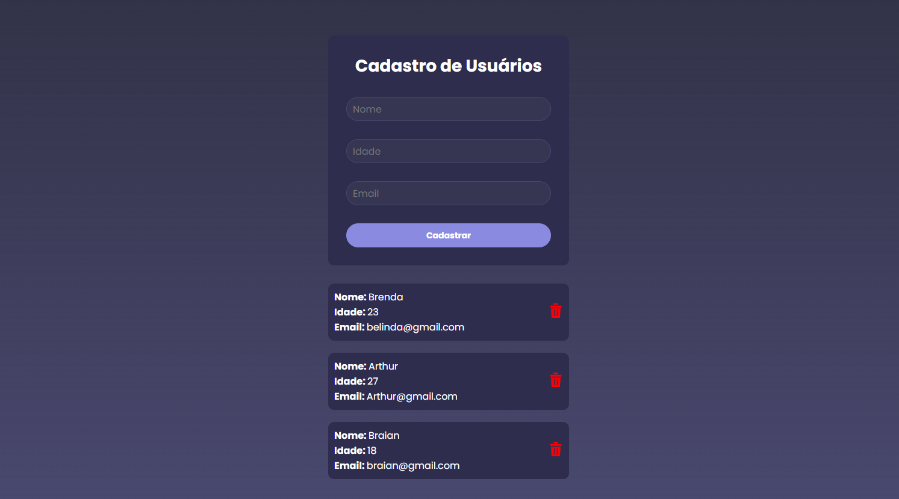

# 📋 Cadastro de Usuários – Front-end em React

Este projeto é uma aplicação **front-end desenvolvida em React** com fins **didáticos**, focada em praticar conceitos básicos da biblioteca, como componentes, estados e renderização de listas.

Atualmente, o projeto **não possui integração com back-end**. Todos os dados são manipulados apenas no lado do cliente.

---

## 🖼️ Preview da aplicação

> Interface desenvolvida:




---

## 🎯 Objetivo do projeto

- Praticar **React** de forma simples e visual  
- Trabalhar com **formulários controlados**  
- Utilizar **useState** para gerenciar dados  
- Renderizar listas dinamicamente  
- Criar uma interface moderna e organizada  

---

## 🧩 Funcionalidades

- Formulário para cadastro de usuários com:
  - Nome
  - Idade
  - Email
- Exibição da lista de usuários cadastrados
- Botão de exclusão de usuários (somente no front-end)
- Interface estilizada e responsiva

---

## 🛠️ Tecnologias utilizadas

- **React**
- **JavaScript (ES6+)**
- **CSS**
- **Vite** ou **Create React App** (dependendo da configuração)

---


## 🚧 Próximos passos (ideias de evolução)

Integração com API / Back-end

Validação de formulários

Persistência de dados (LocalStorage ou banco de dados)

Edição de usuários

Feedback visual (toast, alerts, loading)

## 👩‍💻 Autora

Projeto desenvolvido por Brenda para fins de estudo e prática em React.

## ▶️ Como executar o projeto

```bash
# Clone o repositório:
git clone https://github.com/behnascimentoo/tela-cadastro-usuario.git

# Acesse a pasta do projeto:
cd tela-cadastro-usuario

# Instale as dependências:
npm install

# Inicie o projeto:
npm run dev

# Abra no navegador:
http://localhost:5173 
